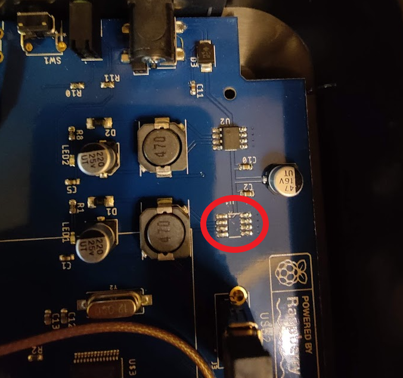
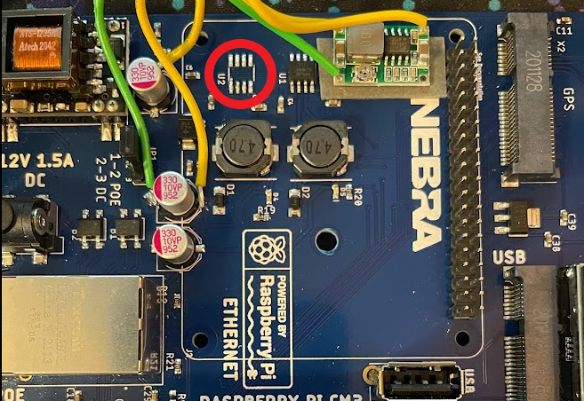
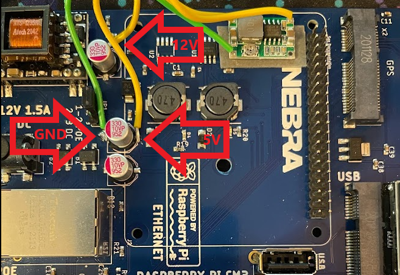
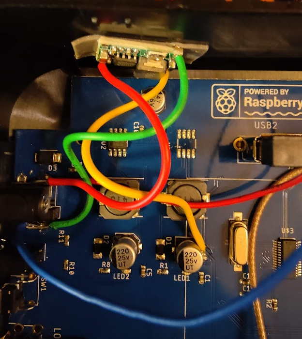

# Nebra Improvement/Repair Guide

This repository goes over the various improvements and repairs you can make to your Nebra Helium Miner. I have had some reliability issues with my Nebra Indoor and Outdoor miners and I have found the following fixes and modifications have helped.

## Replace 5V Voltage Regulator
The stock voltage regulator on the Nebra Miners is very weak. 
I have measured voltages as low as 4.7V when the miner is booted up and running. 

The Raspberry Pi CM3 works best when the voltage is above 5V and my theory is that the instability of the Nebra is due to the weak voltage regulator.

This obviously would void any warranty. Proceed at your own risk!

### Steps
1. Desolder the 5V regulator

Indoor:

Outdoor:

2. Replace with regulator capable of at least 3 amps output. I prefer using a DC to DC buck converter that is adjustable, allowing me to overvoltage slightly to 5.1 volts. Doesn't really matter which one, LM2596 and MP1584EN are easy to find. Adjust before soldering to PCB
3. Connect voltage regulator to GND, 12V, and 5V PCB circuits. I found the following locations easy to solder to.

For outdoor, I soldered to the 12V and 5V capacitors:

For indoor, I soldered to the 12V barrel plug (red wire is 12V, greed wire is ground), and the 5V capacitor (yellow wire).

4. Secure wires and voltage regulator to prevents shorts.

## Replace Raspberry Pi CM3 with CM4

If your Raspberry Pi Compute Module 3 is broken, it can be hard to find a replacement as they have been replaced by the CM4. The CM3 can be replaced by the CM4 but it will require some hardware and software modification. These modifications are not for the faint of heart so only procede as a last resort. 

Unfortunately the CM4 is not a drop in replacement of the CM3. First of all the OS is incompatiable and will not boot up. In addition the GPIO is limited on the CM4 and does not have GPIO 

### Materials Needed
1. Raspberry Pi CM4 (1GB ram sufficient)
2. CM4 to CM3 adapter, I use the one from geekworm
3. Small wire

### Hardware Modifications
1. Replace CM3 with CM4 and adpater
2. Connect 

### Installing BalenaOS on SD Card
1. Create a Balena Cloud account and log into dashboard
2. Set up a fleet
3. Add a device
4. Select Raspberry Pi CM4 IO Board
5. Fill out the remaining fields, the defaults should suffice unless you are running on WiFi in which case enter your network credentials
6. Download the image
7. Flash image to the SD Card (ECC if applicable) you plan on using in the miner using Balena Etcher or your method of choice
8. Go to the boot partition and replace the config.txt file with the config.txt file in this repository

### Deploying Software
Note these instructions apply to linux, not sure of the steps on other OSes
1. 

