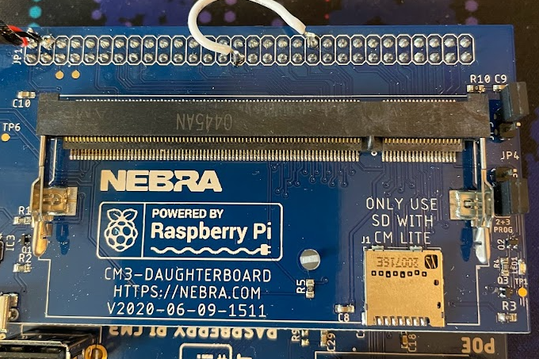

# Nebra Improvement/Repair Guide

This repository goes over the various improvements and repairs you can make to your Nebra Helium Miner. I have had some reliability issues with my Nebra Indoor and Outdoor miners and I have found the following fixes and modifications have helped.

## Replace 5V Voltage Regulator
The stock voltage regulator on the Nebra Miners is very weak. 
I have measured voltages as low as 4.7V when the miner is booted up and running. 

The Raspberry Pi CM3 works best when the voltage is above 5V and my theory is that the instability of the Nebra is due to the weak voltage regulator.

This obviously would void any warranty. Proceed at your own risk!

### Steps
1. Desolder the 5V regulator

Indoor:

Outdoor:

2. Replace with a regulator capable of at least 3 amps output. I prefer using a DC to DC buck converter that is adjustable, allowing me to overvoltage slightly to 5.1 volts. Doesn't really matter which one, LM2596 and MP1584EN are easy to find. Adjust voltage before soldering to PCB.
3. Connect voltage regulator to GND, 12V, and 5V PCB circuits. I found the following locations easy to solder to.

For outdoor, I soldered to the 12V and 5V capacitors:

For indoor, I soldered to the 12V barrel plug (red wire is 12V, green wire is ground), and the 5V capacitor (yellow wire).

4. Secure wires and voltage regulator to prevents shorts.

## Replace Raspberry Pi CM3 with CM4

If your Raspberry Pi Compute Module 3 is broken, it can be hard to find a replacement as they have been replaced by the CM4. The CM3 can be replaced by the CM4 but it will require some hardware and software modification. These modifications are not for the faint of heart so only proceed as a last resort. 

Unfortunately the CM4 is not a drop in replacement of the CM3. First of all the OS is incompatiable and will not boot up. In addition the GPIO is limited on the CM4 and does not have the GPIO pin needed to reset the LoRa concentrator and therefore needs to be remapped on the hardware and in the software. The hardware modification can be done by soldering a small jumper wire on the CM3 daughterboard. The software modification requires us to deploy BalenaOS on the device and flash modified software to the miner that you will need to update as new miner updates are released.

This obviously would void any warranty. Proceed at your own risk!

### Materials Needed
1. Raspberry Pi CM4 (1GB ram sufficient)
2. CM4 to CM3 adapter, I used the one from geekworm
3. Small wire

### Hardware Modifications
1. Replace CM3 with CM4 and adpater. Note that this will prevent you from connecting the USB cable on the outdoor miner meaning you can no longer use Bluetooth or WiFi without further modification. 
2. Connect GPIO13 to GPIO38 on the CM3 daughterboard by soldering a small jumper wire between the 2 header pins. Reason for this is that the CM4 does not have a GPIO38 and this pin is used by the Nebra software to reset the LoRa transceiver. I have built a new packet forwarder docker container that changes the code to use GPIO13 instead of GPIO38 to reset the LoRa transceiver.

### Installing BalenaOS on SD Card
1. Create a Balena Cloud account and log into dashboard
2. Set up a fleet
3. Add a device
4. Select Raspberry Pi CM4 IO Board
5. Fill out the remaining fields, the defaults should suffice unless you are running on WiFi in which case enter your network credentials
6. Download the image
7. Flash image to the SD Card (eMMC if applicable) you plan on using in the miner using Balena Etcher or your method of choice
8. Go to the boot partition and replace the config.txt file with the [config.txt](https://github.com/james-carl-git/helium-miner-software/blob/master/config.txt) file in this repository. This is required in order to enable USB2 ports on the CM4.

### Deploying Software
1. Plug in your miner and make sure it is showing up in your balena dashboard
2. Download the [docker-compose.yml](https://github.com/james-carl-git/helium-miner-software/blob/master/docker-compose.yml) and place in an empty folder on your computer
3. Go to the balena dashboard and navigate to the fleet you created -> releases -> Add release. Copy the provided command
4. Navigate with your CLI to the folder you downloaded the docker-compose.yml file to and run the copied commands
5. After a couple minutes, the build should finish and you should see your miner getting updated to the release you just built. Note that this is how you will also need to update your miner if a new release is required. When updating, I have found that you sometimes need to "purge data" on your device from the dashboard to get the miner working after an update. 

## Add Cooling
I have created the following 3D printed part that allow you to add cooling to your indoor miner in case it is prone to overheating: 

https://www.thingiverse.com/thing:5015991

